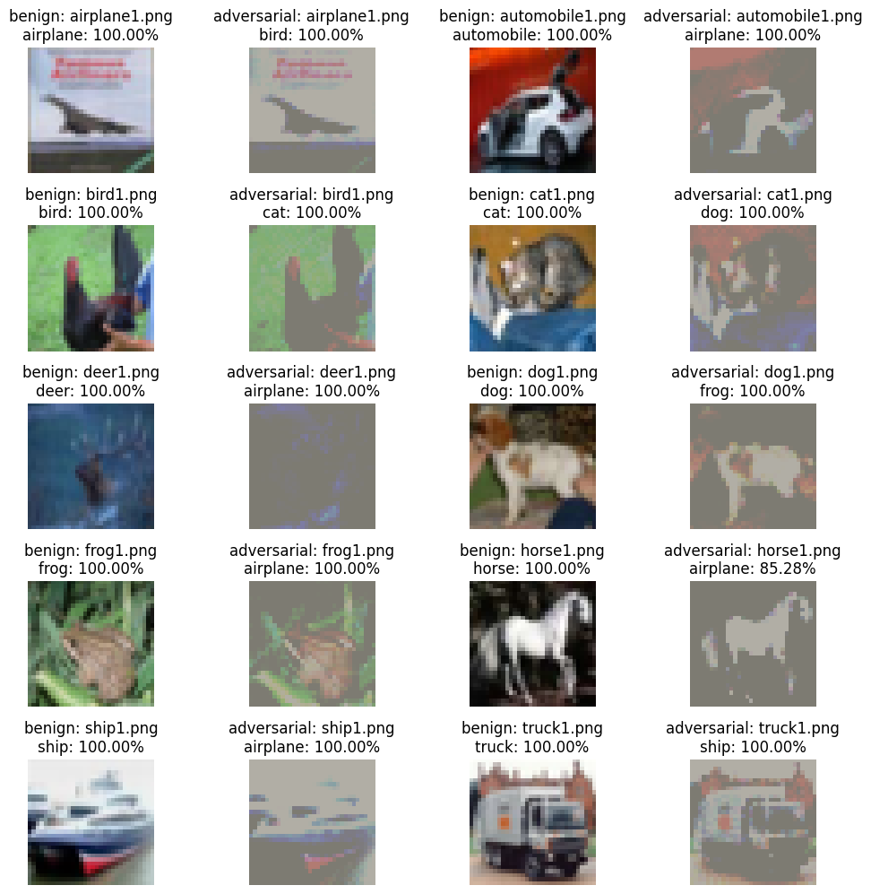

# Adversarial Attack on CIFAR-10

This project demonstrates adversarial attacks on deep neural networks trained on the CIFAR-10 dataset. In this project, we implement several attack algorithms including FGSM (Fast Gradient Sign Method), IFGSM (Iterative FGSM), and MI-FGSM (Momentum Iterative FGSM) using PyTorch and pretrained models from the pytorchcv library. An ensemble of models is also used to generate more robust adversarial examples.

## Table of Contents

- [Overview](#overview)
- [Environment & Data Setup](#environment--data-setup)
- [Project Structure](#project-structure)
- [Usage](#usage)
- [Results](#results)
- [Contributing](#contributing)
- [License](#license)

## Overview

Adversarial attacks add carefully crafted perturbations to input images in order to deceive neural network classifiers. The goal is to slightly modify images so that the changes are visually imperceptible while causing the model to misclassify them. In our project, we:
- Set up the environment and download the CIFAR-10 related dataset.
- Load pretrained models (e.g., ResNet and an ensemble of different architectures).
- Implement attack algorithms: FGSM, IFGSM, and MI-FGSM.
- Generate adversarial examples and evaluate model performance on both benign and adversarial images.
- Archive the generated adversarial examples for further analysis.

## Environment & Data Setup

Before running the notebook, install the required packages and download the dataset:

pip install pytorchcv
pip install imgaug
wget https://www.dropbox.com/s/lbpypqamqjpt2qz/data.zip
unzip ./data.zip


## Project Structure
```
├── data/                   # Folder containing the benign images
├── fgsm/                   # Folder storing FGSM-generated adversarial examples
├── mifgsm/                 # Folder storing MI-FGSM-generated adversarial examples
├── fgsm.tgz                # Archive of FGSM adversarial examples
├── mifgsm.tgz              # Archive of MI-FGSM adversarial examples
├── adversarial_attack.ipynb# Jupyter Notebook with full code and explanation
├── README.md               # This file
└── requirements.txt        # Required Python packages
```
## Usage
Run the Notebook:
Open the adversarial_attack.ipynb in Jupyter Notebook and execute the cells sequentially. This will:

Set up the environment and load the dataset.
Initialize and evaluate the pretrained CIFAR-10 model.
Generate adversarial examples using FGSM, IFGSM, and MI-FGSM attacks.
Save the adversarial images in the corresponding directories (fgsm and mifgsm).

## Archive the Results:
After generating the adversarial examples, the script archives them into fgsm.tgz and mifgsm.tgz for easy sharing and analysis.

## Results
The notebook includes code to visualize the differences between benign and adversarial examples. For instance, the following images show sample outputs:

Ensemble Attack Visualization
Benign Image

 : An example of a benign image from the CIFAR-10 dataset with its predicted label. with Adversarial Image (MI-FGSM):  The corresponding adversarial image generated using MI-FGSM. Note the slight perturbations that cause the model to misclassify the image.

Additionally, a separate example is provided for a "dog" image where  the benign image is correctly classified 

and  

the adversarial version causes misclassification.


## Contributing
Contributions are welcome! If you wish to contribute:

- Fork this repository.
- Create a new branch for your feature or bug fix.
- Commit your changes with a descriptive message.
- Open a pull request.

## License
Feel free to modify the content, image paths, or add more sections as needed. Once updated, you can publish the repository on GitHub.
